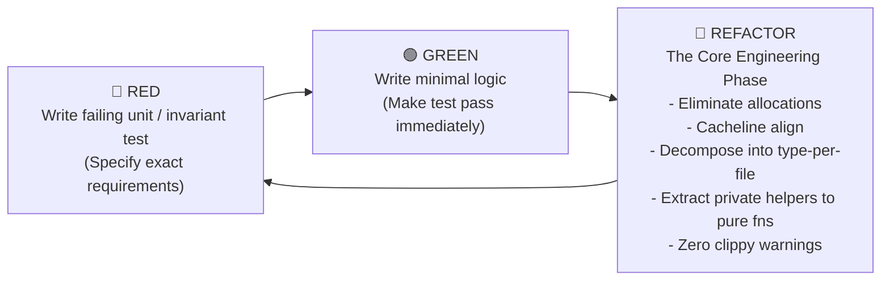

# Flotilla Coding Standards & Architectural Invariants

Flotilla is a zero-allocation, sans-I/O Raft consensus engine implemented in Safe Rust (Rust 1.99+ / Edition 2024).

These engineering standards are strict, non-negotiable invariants designed to guarantee deterministic execution, mathematical correctness, microsecond-level latency predictability, and complete modularity. Every contributor and code reviewer must uphold these four foundational standards:

1. **Test-Driven Development (TDD)**: Red -> Green -> Refactor (with heavy, uncompromising focus on the **Refactor** phase).
2. **Zero-Allocation Hot Path**: Constant-memory execution along all steady-state consensus paths with compile-time power-of-two ring buffers, `zerocopy 0.8`, and cacheline alignment.
3. **Type-per-File Decomposition**: Exactly one primary struct, enum, or trait per source file.
4. **No Private Helper Methods**: Prohibit `fn helper(&self)` inside `impl` blocks; decompose logic into standalone, crate-visible pure functions and dedicated types.

---

## 1. Test-Driven Development (TDD) & The Refactor Imperative

In Flotilla, tests are not an afterthought or a post-implementation verification step. They are **executable specifications** that codify consensus invariants, bounds, and state transitions before code is written.

### The Red -> Green -> Refactor Cycle



#### Phase 1: 🔴 Red (Specification First)
- Before modifying or adding production logic, author a failing test asserting exact requirements.
- Test cases must target:
  - Boundary conditions and overflow/underflow cases.
  - State machine invariants (e.g., term monotonicity, log matching, commit index monotonically advancing).
  - Malformed packet framing and CRC32 corruption rejection.
- Run the test suite to confirm the test fails for the expected reason (not due to a compilation error).

#### Phase 2: 🟢 Green (Minimal Implementation)
- Write the minimum viable logic required to make the failing test pass.
- Resist the temptation to prematurely optimize, over-generalize, or add speculative code during this phase.

#### Phase 3: 🔵 Refactor (The Critical Centerpiece)
The Refactor phase is where production-grade software is forged. Passing tests alone do **not** qualify code for merging. During the refactor phase, developers must rigorously audit and refine the implementation against the following checklist:

1. **Eliminate Heap Allocations**: Ensure no dynamic allocations (`Vec::push`, `Box::new`, `format!`, `String`, `.to_vec()`) occur on steady-state consensus paths. Replace with pre-allocated circular buffers, fixed-size arrays, or borrowed slices.
2. **Modular Decomposition**: Verify that any new struct, enum, or trait is extracted into its own dedicated file matching its snake_case name.
3. **No Private Helpers**: Identify any inline helper routines created inside `impl` blocks and decompose them into standalone, crate-visible (`pub` or `pub(crate)`) pure functions or separate types.
4. **Cacheline & Memory Layout**: Ensure high-contention structures have `#[repr(align(64))]` to prevent CPU cacheline bouncing.
5. **Clippy Hygiene**: Eliminate 100% of clippy warnings (`cargo clippy --all-targets -- -D warnings`).
6. **Zero-Allocation Verification**: Verify that the tracking allocator suite (`tests/zero_alloc_tests.rs`) runs cleanly with `0` allocations.
7. **Coverage Enforcement**: Confirm that line coverage is $\ge 85\%$ and branch coverage is $\ge 90\%$.

---

## 2. Zero-Allocation Hot Path Standards

Garbage collection pauses, allocator lock contention, and heap fragmentation degrade consensus determinism. Flotilla guarantees constant-memory execution along all steady-state paths.

### Hot Path Definition
The **hot path** encompasses all code executed:
- Per inbound or outbound packet (`step`).
- Per timer advancement tick (`tick`).
- Per client proposal append (`propose`).
- Per log entry replication and commit index evaluation.
- Per wire framing encode and decode.

### Invariants & Rules

1. **Zero Steady-State Allocations**:
   - Strictly prohibited on the hot path: `Vec::new()`, `Vec::push()`, `Box::new()`, `format!()`, `String::from()`, `to_string()`, `.to_vec()`, `clone()` on heap-allocated types, and dynamic dispatch via `Box<dyn Trait>`.
   - Permitted: Borrowed slices `&[u8]`, fixed-size stack buffers `[u8; N]`, and pre-allocated circular buffers.

2. **Power-of-Two Ring Buffers**:
   - Circular buffer capacities must be powers of two, enforced at compile time:
     ```rust
     const { assert!(N > 0 && (N & (N - 1)) == 0, "Capacity must be a power of two") }
     ```
   - This enables branchless $O(1)$ bitwise masking instead of expensive modulo division:
     ```rust
     let slot_idx = (index.0 - 1) as usize & (CAPACITY - 1);
     ```

3. **Safe Transmutation via `zerocopy 0.8`**:
   - Binary wire headers and packet payloads must derive `zerocopy::FromBytes`, `zerocopy::IntoBytes`, and `zerocopy::Immutable`.
   - Never use `unsafe std::mem::transmute`. Let the compiler prove memory safety, alignment, and size invariants at compile time.

4. **Cacheline False Sharing Mitigation**:
   - Concurrent, high-throughput structures (such as [`LogSlot`](file:///home/chad/source/rust/flotilla/src/storage/log_slot.rs)) must be aligned to CPU L1/L2 cache lines (64 bytes):
     ```rust
     #[repr(align(64))]
     #[derive(Clone, Copy, Debug, PartialEq, Eq)]
     pub struct LogSlot<const MAX_PAYLOAD: usize> {
         pub term: Term,
         pub index: LogIndex,
         pub payload_len: u32,
         pub payload: [u8; MAX_PAYLOAD],
     }
     ```

5. **Safe Chunking & Slicing**:
   - Use safe slice chunking primitives (`split_first_chunk::<N>()`, `as_chunks::<N>()`) instead of manual pointer arithmetic or unchecked index slicing.

6. **Automated Tracking Allocator Verification**:
   - Consensus hot paths must be tested using a custom `#[global_allocator]` tracking harness (see [`tests/zero_alloc_tests.rs`](file:///home/chad/source/rust/flotilla/tests/zero_alloc_tests.rs)) that asserts `ALLOC_COUNT == 0` and `ALLOC_BYTES == 0` during active iteration.

---

## 3. Type-per-File Modular Decomposition

Monolithic multi-thousand-line files obscure subsystem boundaries, create merge conflicts, and hinder code audits. Flotilla enforces a strict **type-per-file** structure.

### Invariants & Rules

1. **One Primary Type Per File**:
   - Every `struct`, `enum`, or `trait` resides in its own dedicated source file.
   - For example:
     - [`NodeId`](file:///home/chad/source/rust/flotilla/src/types/node_id.rs) in `src/types/node_id.rs`
     - [`Term`](file:///home/chad/source/rust/flotilla/src/types/term.rs) in `src/types/term.rs`
     - [`RingBufferLogStorage`](file:///home/chad/source/rust/flotilla/src/storage/ring_buffer_log_storage.rs) in `src/storage/ring_buffer_log_storage.rs`
     - [`ElectionState`](file:///home/chad/source/rust/flotilla/src/election/election_state.rs) in `src/election/election_state.rs`
     - [`CosmosOffloader`](file:///home/chad/source/rust/flotilla/src/archive/cosmos/offloader.rs) in `src/archive/cosmos/offloader.rs`
     - [`OffloaderCommand`](file:///home/chad/source/rust/flotilla/src/archive/cosmos/offloader_command.rs) in `src/archive/cosmos/offloader_command.rs`

2. **File Naming Convention**:
   - The file name must match the type name in `snake_case` (e.g., `LogSlot` $\rightarrow$ `log_slot.rs`).

3. **Submodule Directory Organization**:
   - Subsystems are organized into dedicated folders:
     - `src/types/`: Core domain scalar value wrappers (`NodeId`, `Term`, `LogIndex`, `Role`, `HardState`).
     - `src/message/`: Strongly typed Raft protocol wire payloads (`RequestVoteArgs`, `AppendEntriesHeader`, `ClientProposalReply`, etc.).
     - `src/codec/`: Packet framing headers and zero-copy encoders/decoders.
     - `src/storage/`: In-memory power-of-two circular buffer storage (`RingBufferLogStorage`, `LogSlot`).
     - `src/election/`: Randomized election timer, voting rules, and candidate state machine.
     - `src/replication/`: Follower append evaluator and peer progress tracker.
     - `src/engine/`: Sans-I/O Raft consensus engine node (`RaftNode`), configuration, and outbound actions.
     - `src/client/`: Pluggable client abstractions (`FlotillaClient`, `ClientConfig`, `ClientError`, `ProposalResult`) and transports (`UdpClient`, `TcpClient`, `GrpcClient`).
     - `src/server/`: Transport server listeners and protocol services (`ServerConfig`, `ServerError`, `UdpListener`, `TcpListener`, `GrpcService`).
     - `src/archive/`: Asynchronous background pipeline, sinks (`FileArchiveSink`, `NullArchiveSink`), and compaction offloaders.
     - `src/udp/`: UDP socket driver and cluster address router.

4. **Dedicated Pure Function Files**:
   - Standalone functions that do not belong to a single struct (e.g. mathematical evaluation or packet builders) are grouped in dedicated files:
     - [`rules.rs`](file:///home/chad/source/rust/flotilla/src/election/rules.rs): Quorum calculation and log freshness checks.
     - [`evaluator.rs`](file:///home/chad/source/rust/flotilla/src/replication/evaluator.rs): Standalone follower AppendEntries verification logic.
     - [`commit.rs`](file:///home/chad/source/rust/flotilla/src/commit.rs): Quorum median index calculation and commit advancement.
     - [`packets.rs`](file:///home/chad/source/rust/flotilla/src/engine/packets.rs): Outbound datagram and proposal packet construction.
     - [`udp/framing.rs`](file:///home/chad/source/rust/flotilla/src/udp/framing.rs): UDP MTU bounds checks.
     - [`client/tcp/framing.rs`](file:///home/chad/source/rust/flotilla/src/client/tcp/framing.rs): Async TCP length-prefixed frame encoding and decoding.

5. **Submodule `mod.rs` & Re-exports**:
   - Submodule `mod.rs` files declare submodules (`pub mod type_name;`) and re-export them (`pub use type_name::TypeName;`) to maintain clean public APIs without deeply nested import paths.

---

## 4. Prohibition of Private Helper Methods

Hiding complex algorithms in private methods (`fn helper(&self)` inside an `impl Struct` block) creates untestable, opaque state machines.

### Invariants & Rules

1. **No Private Methods in Inherent `impl` Blocks**:
   - Every method defined on a struct in an inherent `impl` block must be crate-visible (`pub` or `pub(crate)`).
   - Private methods without visibility modifiers (`fn helper(...)`) are **strictly prohibited**.

2. **Decompose to Standalone Pure Functions**:
   - Any computational algorithm, validation check, packet constructor, or state transformation must be extracted into a standalone, crate-visible pure function.
   - Pure functions take explicit arguments and return deterministic results without mutating hidden struct state.

3. **100% Isolated Unit Testability**:
   - Because all routines are standalone pure functions, unit tests can test every edge case directly without needing to construct a complex parent struct or simulate multi-step workflows.

### Anti-Pattern vs. Flotilla Decomposition

#### ❌ Anti-Pattern: Private Helper Hidden in Struct `impl`
```rust
// BAD: Hidden private helper method
impl RaftNode {
    pub fn step(&mut self, packet: &[u8]) -> Result<(), EngineError> {
        // ...
        self.evaluate_append_entries(prev_idx, prev_term)?;
        // ...
    }

    // Prohibited! Cannot be tested in isolation without a full RaftNode.
    fn evaluate_append_entries(&mut self, prev_idx: LogIndex, prev_term: Term) -> Result<(), EngineError> {
        if self.storage.term_at(prev_idx) != Some(prev_term) {
            return Err(EngineError::InvalidPacket);
        }
        Ok(())
    }
}
```

#### ✅ Flotilla Pattern: Standalone Pure Function in Dedicated Module
```rust
// GOOD: Decomposed into src/replication/evaluator.rs
pub fn evaluate_follower_append_entries<const CAPACITY: usize, const MAX_PAYLOAD: usize>(
    header: &AppendEntriesHeader,
    entries_raw: &[u8],
    storage: &mut RingBufferLogStorage<CAPACITY, MAX_PAYLOAD>,
    commit_index: &mut LogIndex,
) -> FollowerAppendResult {
    // Pure algorithmic verification
    if header.prev_log_index.0 > 0 {
        match storage.term_at(header.prev_log_index) {
            Some(term) if term == header.prev_log_term => {}
            _ => return FollowerAppendResult::Rejected,
        }
    }
    // ...
    FollowerAppendResult::Success { match_index }
}

// In RaftNode::step:
let result = evaluate_follower_append_entries(&hdr, entries_raw, &mut self.storage, &mut self.commit_index);
```
*Benefits*:
- `evaluate_follower_append_entries` can be comprehensively unit tested across 20+ edge cases in [`tests/replication_tests.rs`](file:///home/chad/source/rust/flotilla/tests/replication_tests.rs) with zero mocking and zero engine setup.
- `RaftNode` remains a lean orchestrator with high readability and zero hidden coupling.

---

## 5. Sans-I/O Consensus Model

The core consensus state machine must remain completely independent of external side effects:

1. **No Network Sockets**: The consensus engine never imports `std::net` or socket handles. Datagram bytes enter via `step(sender, packet_bytes)` and exit via `Vec<OutboundMessage>`.
2. **No Clocks**: The engine does not call `std::time::Instant::now()` or `std::time::SystemTime::now()`. Time advances solely through discrete, deterministic `tick()` calls.
3. **No Threads or Async Runtimes**: The engine core never imports `std::thread`, `tokio`, or `async-std`. It executes purely as a synchronous state transition function in memory.
4. **Deterministic Simulation**: All consensus scenarios (split votes, packet loss, partitions, term leaps) are 100% reproducible and run instantaneously in single-threaded unit tests.

---

## 6. Code Review & Pull Request Checklist

Before submitting a Pull Request, verify that all standards are met:

- [ ] **TDD Workflow**: Was a failing test written *before* the implementation?
- [ ] **Refactor Audit**: Was the code thoroughly refactored after passing tests?
- [ ] **No Private Helpers**: Are there zero private `fn` methods in `impl` blocks?
- [ ] **Type-per-File**: Does every struct, enum, and trait have its own dedicated snake_case file?
- [ ] **Zero Allocations**: Are steady-state hot paths free from `Vec::push`, `Box::new`, `format!`, and heap allocations?
- [ ] **Tracking Allocator**: Does `cargo test --test zero_alloc_tests` pass with 0 allocations?
- [ ] **Standards Verification**: Does `python3 .github/scripts/check_coding_standards.py` pass?
- [ ] **Coverage Gate**: Does `cargo llvm-cov` meet $\ge 85\%$ line and $\ge 90\%$ branch coverage?
- [ ] **Clippy**: Does `cargo clippy --all-targets -- -D warnings` pass cleanly?
- [ ] **Format**: Does `cargo fmt -- --check` pass?

---

## 7. Verification Commands

Run the full local verification pipeline:

```bash
# 1. Run all unit, integration, and transport tests (default and all features)
cargo test --all-targets
cargo test --all-targets --all-features

# 2. Verify zero-allocation hot paths with custom tracking allocator
cargo test --test zero_alloc_tests

# 3. Enforce structural standards (type-per-file, no private helpers)
python3 .github/scripts/check_coding_standards.py
cargo test --test coding_standards_tests

# 4. Check for clippy warnings across all features
cargo clippy --all-targets --all-features -- -D warnings

# 5. Verify documentation build
cargo doc --all-features --no-deps

# 6. Run test coverage gate
cargo llvm-cov --branch --json --summary-only --output-path coverage.json
python3 .github/scripts/check_coverage.py coverage.json --min-line 85.0 --min-branch 90.0
```
