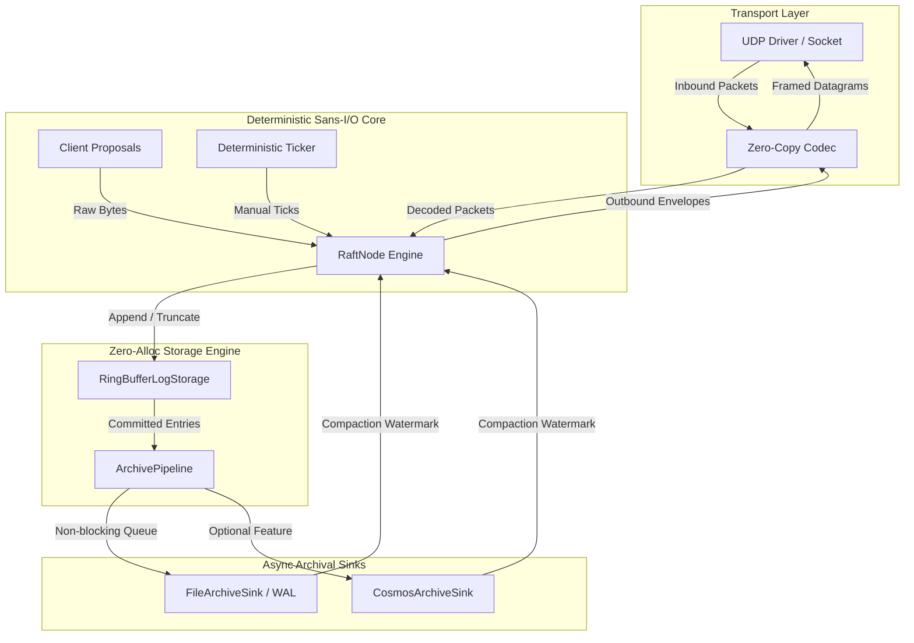

# Flotilla

[](LICENSE)
[-orange.svg)](Cargo.toml)
[](CODING_STANDARDS.md#5-sans-io-consensus-model)
[](CODING_STANDARDS.md#2-zero-allocation-hot-path-standards)
[](.github/workflows/coverage.yml)

> **High-Throughput, Low-Latency Sans-I/O Raft Consensus in Safe Rust (Rust 1.98+ / Edition 2024).**

Flotilla is a deterministic, constant-memory distributed consensus engine engineered for mission-critical systems where garbage collection pauses, memory allocator lock contention, and asynchronous runtime stalls are unacceptable. By decoupling consensus logic from operating system side effects (networking, clocks, and disk drives), Flotilla achieves microsecond-level latency predictability and 100% reproducible simulation.

---

## 🏛️ Core Architectural Pillars



### 1. Sans-I/O State Machine
The core consensus engine imports no socket primitives (`std::net`), no system clocks (`Instant::now`), and no thread-spawning runtimes (`std::thread`, `tokio`). All state transitions occur through deterministic memory functions:
- `RaftNode::step(sender, packet_bytes) -> Result<Vec<OutboundMessage>, EngineError>`
- `RaftNode::tick() -> Vec<OutboundMessage>`

### 2. Zero-Allocation Hot Path Execution
Steady-state log appending, follower AppendEntries validation, packet framing, and election timer updates execute with **zero dynamic heap allocations**. Memory is backed by pre-allocated, power-of-two static circular buffers and borrowed slices.

### 3. Type-per-File Modular Decomposition
Every `struct`, `enum`, and `trait` is strictly isolated into its own dedicated source file matching its snake_case name. No sprawling god-files or tangled multi-type definitions.

### 4. Prohibition of Private Helper Methods
Inherent `impl` blocks strictly prohibit private helper methods (`fn helper(&self)`). Algorithmic evaluations, rules, and packet builders are decomposed into standalone, crate-visible (`pub` or `pub(crate)`) pure functions. This enables 100% isolated unit testability without mocking.

### 5. Test-Driven Development with Heavy Focus on Refactoring
Every feature follows the **Red -> Green -> Refactor** cycle. The **Refactor** phase is the primary engineering driver: eliminating allocations, verifying cacheline alignment, decomposing into single types, and enforcing zero compiler warnings.

---

## 📋 Best Practices & Engineering Standards

Flotilla adheres to four non-negotiable coding standards. For the complete specification and guidelines, see [**`CODING_STANDARDS.md`**](file:///home/chad/source/rust/flotilla/CODING_STANDARDS.md).

### 1. Test-Driven Development (TDD: Red / Green / Refactor)

```
🔴 RED      ──> Write a failing unit / invariant test specifying exact requirements.
🟢 GREEN    ──> Implement minimal code necessary to make the test pass.
🔵 REFACTOR ──> Deep engineering audit: eliminate allocations, align cachelines,
                decompose into single types, eliminate private helpers, fix clippy.
```

- **Red**: Tests are authored *before* implementation logic.
- **Green**: Minimal, unbloated code to satisfy the test.
- **Refactor (The Priority)**: Refactoring is where architectural excellence is achieved. Code is audited for zero allocations, cacheline alignment, modularity, and zero clippy warnings before submitting.
- **Coverage Standard**: Strict CI enforcement of **$\ge 85\%$ line coverage** and **$\ge 90\%$ branch coverage**.

### 2. Zero Steady-State Allocation Standard

- **No Heap Calls on Hot Path**: Never call `Vec::new`, `Vec::push`, `Box::new`, `format!`, `String`, or `.to_vec()` on consensus hot paths.
- **Power-of-Two Ring Buffers**: Static capacity verified at compile-time via:
  ```rust
  const { assert!(N > 0 && (N & (N - 1)) == 0, "Capacity must be a power of two") }
  ```
  Enables branchless $O(1)$ bitwise masking (`(index - 1) & (CAPACITY - 1)`).
- **Cacheline Alignment**: High-contention slots derive `#[repr(align(64))]` to prevent CPU cacheline bouncing.
- **Safe Transmutation**: Wire packets derive `zerocopy 0.8` (`FromBytes`, `IntoBytes`, `Immutable`). `unsafe std::mem::transmute` is forbidden.
- **Automated Verification**: The test suite includes a custom `#[global_allocator]` tracking harness in [`tests/zero_alloc_tests.rs`](file:///home/chad/source/rust/flotilla/tests/zero_alloc_tests.rs) asserting 0 allocations across all hot paths.

### 3. Type-per-File Decomposition Standard

- Exactly **one primary type per file** named in `snake_case` matching the type's `PascalCase` name.
- Domain modules under `src/` organize types cleanly:
  - Primitives: [`NodeId`](file:///home/chad/source/rust/flotilla/src/types/node_id.rs), [`Term`](file:///home/chad/source/rust/flotilla/src/types/term.rs), [`LogIndex`](file:///home/chad/source/rust/flotilla/src/types/log_index.rs), [`Role`](file:///home/chad/source/rust/flotilla/src/types/role.rs), [`HardState`](file:///home/chad/source/rust/flotilla/src/types/hard_state.rs)
  - Messages: [`MsgType`](file:///home/chad/source/rust/flotilla/src/message/msg_type.rs), [`RequestVoteArgs`](file:///home/chad/source/rust/flotilla/src/message/request_vote_args.rs), [`RequestVoteReply`](file:///home/chad/source/rust/flotilla/src/message/request_vote_reply.rs), [`AppendEntriesHeader`](file:///home/chad/source/rust/flotilla/src/message/append_entries_header.rs), [`AppendEntriesReply`](file:///home/chad/source/rust/flotilla/src/message/append_entries_reply.rs), [`RaftMessage`](file:///home/chad/source/rust/flotilla/src/message/raft_message.rs)
  - Codec: [`PacketHeader`](file:///home/chad/source/rust/flotilla/src/codec/packet_header.rs), [`CodecError`](file:///home/chad/source/rust/flotilla/src/codec/codec_error.rs)
  - Storage: [`LogSlot`](file:///home/chad/source/rust/flotilla/src/storage/log_slot.rs), [`StorageError`](file:///home/chad/source/rust/flotilla/src/storage/storage_error.rs), [`RingBufferLogStorage`](file:///home/chad/source/rust/flotilla/src/storage/ring_buffer_log_storage.rs)
  - Election: [`ElectionAction`](file:///home/chad/source/rust/flotilla/src/election/election_action.rs), [`ElectionConfig`](file:///home/chad/source/rust/flotilla/src/election/election_config.rs), [`ElectionState`](file:///home/chad/source/rust/flotilla/src/election/election_state.rs)
  - Replication: [`PeerProgress`](file:///home/chad/source/rust/flotilla/src/replication/peer_progress.rs), [`PeerProgressTracker`](file:///home/chad/source/rust/flotilla/src/replication/peer_progress_tracker.rs), [`FollowerAppendResult`](file:///home/chad/source/rust/flotilla/src/replication/follower_append_result.rs)
  - Archival: [`ArchivedEntry`](file:///home/chad/source/rust/flotilla/src/archive/archived_entry.rs), [`AsyncArchiveSink`](file:///home/chad/source/rust/flotilla/src/archive/async_archive_sink.rs), [`PipelineError`](file:///home/chad/source/rust/flotilla/src/archive/pipeline_error.rs), [`ArchivePipeline`](file:///home/chad/source/rust/flotilla/src/archive/archive_pipeline.rs), [`FileArchiveSink`](file:///home/chad/source/rust/flotilla/src/archive/file_archive_sink.rs), [`NullArchiveSink`](file:///home/chad/source/rust/flotilla/src/archive/null_archive_sink.rs)
  - Engine: [`RaftConfig`](file:///home/chad/source/rust/flotilla/src/engine/raft_config.rs), [`EngineError`](file:///home/chad/source/rust/flotilla/src/engine/engine_error.rs), [`OutboundMessage`](file:///home/chad/source/rust/flotilla/src/engine/outbound_message.rs), [`RaftNode`](file:///home/chad/source/rust/flotilla/src/engine/raft_node.rs)
  - UDP: [`UdpDriver`](file:///home/chad/source/rust/flotilla/src/udp/udp_driver.rs), [`UdpClusterRouter`](file:///home/chad/source/rust/flotilla/src/udp/udp_cluster_router.rs)

### 4. Prohibition of Private Helper Methods Standard

- **No Private Methods in `impl`**: Every method in an inherent `impl Struct` block is crate-visible (`pub` or `pub(crate)`).
- **Standalone Pure Functions**: Internal algorithms are extracted to standalone pure functions in dedicated files:
  - [`rules.rs`](file:///home/chad/source/rust/flotilla/src/election/rules.rs): Quorum calculation and log freshness checks.
  - [`evaluator.rs`](file:///home/chad/source/rust/flotilla/src/replication/evaluator.rs): Follower AppendEntries verification.
  - [`commit.rs`](file:///home/chad/source/rust/flotilla/src/commit.rs): Quorum median calculations and commit advancement.
  - [`packets.rs`](file:///home/chad/source/rust/flotilla/src/engine/packets.rs): Outbound datagram packet construction.
  - [`framing.rs`](file:///home/chad/source/rust/flotilla/src/udp/framing.rs): MTU size validation.
- **Granular Testability**: Because functions are pure and public, every edge case can be tested with 100% isolation.

---

## 🚀 Quickstart

### 1. Add Flotilla to `Cargo.toml`

```toml
[dependencies]
flotilla = "0.1"

# Optional: Enable Azure Cosmos DB Archival Offloader
# flotilla = { version = "0.1", features = ["cosmos"] }
```

### 2. Basic Engine Instantiation

```rust
use flotilla::engine::{RaftConfig, RaftNode};
use flotilla::types::NodeId;

// Configure node 1 in a 3-node cluster
let config = RaftConfig {
    node_id: NodeId(1),
    peers: vec![NodeId(2), NodeId(3)],
    election_timeout_ticks: 10,
    heartbeat_interval_ticks: 3,
};

// Instantiate node with 1024 slots and 1024-byte payload capacity
let mut node = RaftNode::<1024, 1024>::new(config);

// Trigger a logical timer tick
let outbound_messages = node.tick();

// Step the engine with an inbound datagram
// let actions = node.step(sender_id, &packet_bytes)?;
```

---

## 🧪 Testing, Benchmarks & Quality Gates

Flotilla enforces comprehensive quality checks across the entire codebase.

### Running the Test Suite
```bash
# Run all unit and integration tests
cargo test --all-targets

# Run tests with the optional Cosmos DB feature
cargo test --all-targets --features cosmos
```

### Zero-Allocation Verification Gate
```bash
# Verifies 0 heap allocations across all consensus hot paths via TrackingAllocator
cargo test --test zero_alloc_tests
```

### Coding Standards Enforcement Gate
```bash
# Programmatic structural verification of no-private-helpers and type-per-file
python3 .github/scripts/check_coding_standards.py

# Rust test enforcing structural invariants
cargo test --test coding_standards_tests
```

### Coverage Gate Enforcement (85% Line / 90% Branch)
```bash
cargo llvm-cov --branch --html --output-dir target/llvm-cov/html
cargo llvm-cov report --branch --json --summary-only --output-path coverage.json
python3 .github/scripts/check_coverage.py coverage.json --min-line 85.0 --min-branch 90.0
```

### Clippy Hygiene
```bash
cargo clippy --all-targets -- -D warnings
cargo clippy --all-targets --features cosmos -- -D warnings
```

### Performance Benchmarks
```bash
cargo bench
```

---

## 📁 Repository Map

```
flotilla/
├── CODING_STANDARDS.md         # Comprehensive standards & architectural invariants
├── README.md                   # Primary developer guide & best practices
├── Cargo.toml                  # Dependencies, feature flags, profile settings
├── LICENSE                     # MIT License
├── src/
│   ├── lib.rs                  # Library entrypoint and public module exports
│   ├── commit.rs               # Standalone quorum median commit evaluator
│   ├── types/                  # Single-type scalar wrappers (NodeId, Term, etc.)
│   ├── message/                # Wire message structures (RequestVoteArgs, etc.)
│   ├── codec/                  # PacketHeader (zerocopy 0.8), CodecError, framing
│   ├── storage/                # Power-of-two RingBufferLogStorage, LogSlot
│   ├── election/               # ElectionState, ElectionConfig, rules.rs
│   ├── replication/            # PeerProgressTracker, evaluator.rs
│   ├── engine/                 # RaftNode, RaftConfig, packets.rs, OutboundMessage
│   ├── archive/                # Async archival pipeline, FileArchiveSink, NullArchiveSink
│   │   └── cosmos/             # Optional Cosmos DB offloader subsystem
│   └── udp/                    # Non-blocking UdpDriver, UdpClusterRouter, framing.rs
├── tests/
│   ├── zero_alloc_tests.rs     # Tracking allocator hot path verification
│   ├── coding_standards_tests.rs # Automated structural standards tests
│   ├── archive_tests.rs        # Pipeline and WAL sink tests
│   ├── cluster_tests.rs        # Multi-node loopback cluster tests
│   ├── codec_tests.rs          # Zero-copy serialization roundtrip tests
│   ├── commit_tests.rs         # Quorum median math tests
│   ├── election_tests.rs       # Election timeouts and voting rules tests
│   ├── engine_tests.rs         # Sans-I/O node stepping and proposal tests
│   ├── replication_tests.rs    # Follower log matching evaluator tests
│   ├── storage_tests.rs        # Ring buffer wrap-around and compaction tests
│   └── coverage_expansion_tests.rs # Edge cases ensuring 85%/90% coverage
└── .github/
    ├── scripts/
    │   ├── check_coding_standards.py # Automated standards verification script
    │   └── check_coverage.py         # Coverage gate evaluation script
    └── workflows/
        └── coverage.yml        # GitHub Actions coverage & standards workflow
```

---

## 📄 License

This project is licensed under the MIT License - see the [LICENSE](LICENSE) file for details.

Copyright (c) 2026 Chad Bauers.
