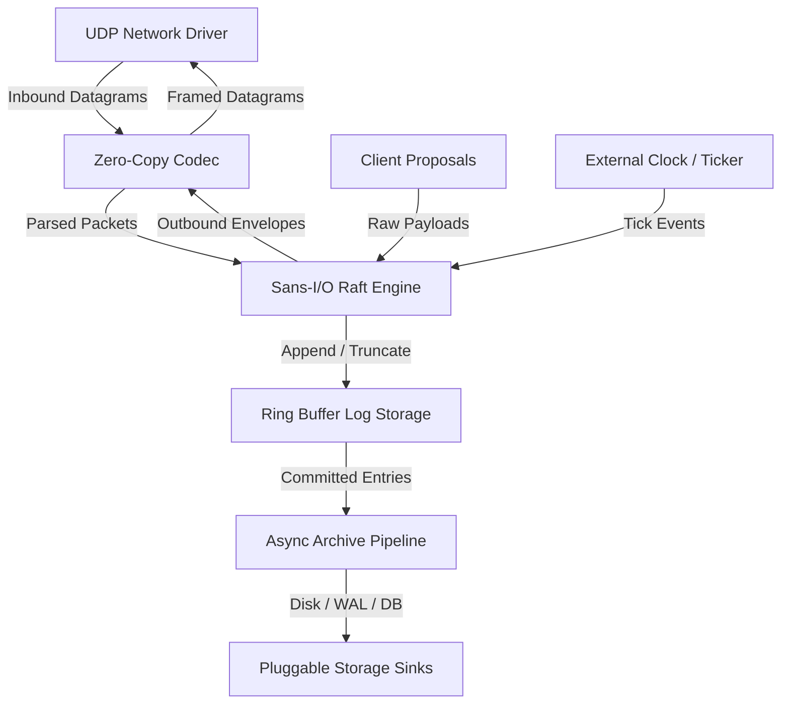

# Flotilla System Overview

## Architectural Mission
Flotilla is engineered for mission-critical, ultra-low-latency distributed consensus where GC pauses, heap allocations, and asynchronous runtime stalls are unacceptable. By strictly adhering to a **sans-I/O deterministic state machine model**, Flotilla separates consensus mathematics and memory transitions from operating system networking, clocks, and disk drives.

## Subsystem Map

### 1. Sans-I/O Deterministic Core (`src/engine.rs`)
- Consensus state transitions execute synchronously via `RaftNode::step(event)` and `RaftNode::tick()`.
- No `tokio`, `async-std`, or background OS threads touch the core state machine.
- Enables 100% deterministic discrete-event simulation, automated fault injection, and microsecond-level test verification.

### 2. Zero-Allocation Hot Path (`src/storage/`, `src/codec.rs`)
- Steady-state log append, commit, vote evaluation, and replication packet framing do not trigger `malloc` / `realloc`.
- In-memory log entries are stored in a pre-allocated circular ring buffer whose capacity is a power of two, enabling $O(1)$ bitwise masking (`index & (CAPACITY - 1)`).
- Packet framing leverages `zerocopy 0.8` (`FromBytes`, `IntoBytes`, `Immutable`) for direct safe serialization without dynamic buffers.

### 3. Modular Public Decomposition (No Private Helper Methods)
- Flotilla avoids monolithic structs with private helper routines.
- Each consensus dimension is decomposed into standalone, publicly visible types and pure functions:
  - `ElectionState`: Term progression, randomized election timers, vote tallying.
  - `PeerProgressTracker`: Peer replication progress, `next_index`, `match_index`, flow control.
  - `CommitEvaluator`: Quorum calculation for commit advancement.
  - `RingBufferLogStorage`: Ring buffer log storage with compile-time assertions.
  - `Codec`: Binary header encoding and packet parsing.

### 4. Pluggable Asynchronous Log Archiving (`src/archive/`)
- To prevent circular ring buffer exhaustion while avoiding synchronous disk I/O on the consensus hot path, committed log entries are transferred across a lock-free/bounded channel to an asynchronous background archiver.
- Sinks implement `AsyncArchiveSink` (e.g., `FileArchiveSink` append-only WAL, `NullArchiveSink`, or database sink).
- Once entries are safely persisted to durable storage, the archiver advances the log compaction watermark, freeing ring buffer slots.

### 5. Datagram Transport over UDP (`src/udp/`)
- Consensus envelopes are mapped onto binary datagrams sized within standard Ethernet MTU (1472 bytes).
- Native Raft log terms and matching indices naturally discard dropped, delayed, or out-of-order UDP packets.
