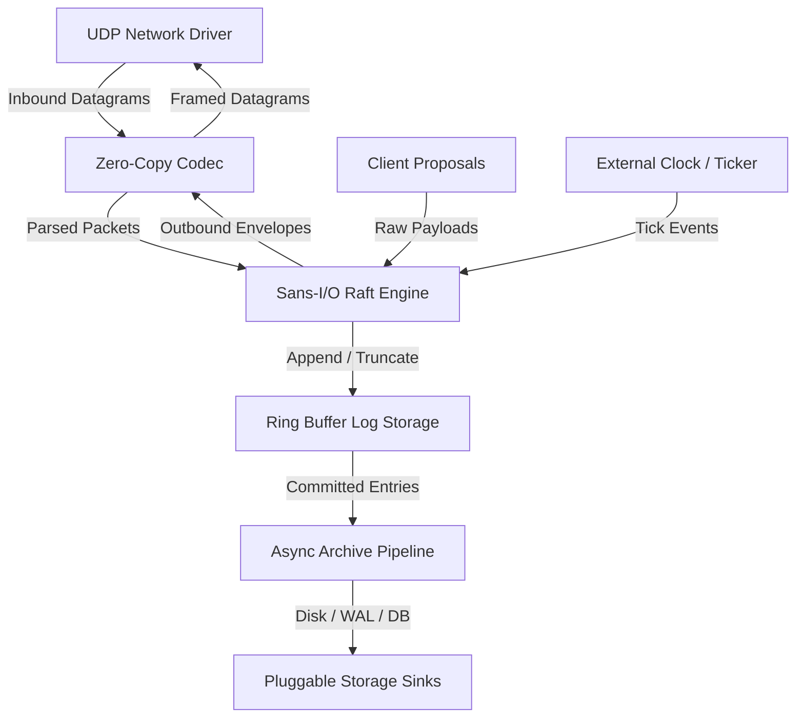

# Flotilla System Overview

## Architectural Mission
Flotilla is engineered for mission-critical, ultra-low-latency distributed consensus where GC pauses, heap allocations, and asynchronous runtime stalls are unacceptable. By strictly adhering to a **sans-I/O deterministic state machine model**, Flotilla separates consensus mathematics and memory transitions from operating system networking, clocks, and disk drives.

## Subsystem Map

### 1. Sans-I/O Deterministic Core (`src/engine/`)
- Consensus state transitions execute synchronously via `RaftNode::step(sender, packet_bytes)` and `RaftNode::tick()`.
- No `tokio`, `async-std`, or background OS threads touch the core state machine.
- Structured across dedicated types: [`RaftNode`](file:///home/chad/source/rust/flotilla/src/engine/raft_node.rs), [`RaftConfig`](file:///home/chad/source/rust/flotilla/src/engine/raft_config.rs), [`EngineError`](file:///home/chad/source/rust/flotilla/src/engine/engine_error.rs), [`OutboundMessage`](file:///home/chad/source/rust/flotilla/src/engine/outbound_message.rs), and packet constructors in [`packets.rs`](file:///home/chad/source/rust/flotilla/src/engine/packets.rs).
- Enables 100% deterministic discrete-event simulation, automated fault injection, and microsecond-level test verification.

### 2. Zero-Allocation Hot Path (`src/storage/`, `src/codec/`)
- Steady-state log append, commit, vote evaluation, and replication packet framing do not trigger `malloc` / `realloc`.
- In-memory log entries are stored in [`RingBufferLogStorage`](file:///home/chad/source/rust/flotilla/src/storage/ring_buffer_log_storage.rs) using pre-allocated [`LogSlot`](file:///home/chad/source/rust/flotilla/src/storage/log_slot.rs) arrays whose capacity is a power of two, enabling $O(1)$ bitwise masking (`(index - 1) & (CAPACITY - 1)`).
- Packet framing leverages [`PacketHeader`](file:///home/chad/source/rust/flotilla/src/codec/packet_header.rs) with `zerocopy 0.8` (`FromBytes`, `IntoBytes`, `Immutable`) for direct safe serialization without dynamic buffers.

### 3. Modular Public Decomposition (Type-per-File Architecture)
- Flotilla prohibits hidden private helper methods inside struct impl blocks.
- Every consensus dimension is decomposed into standalone, crate-public types and pure functions:
  - [`ElectionState`](file:///home/chad/source/rust/flotilla/src/election/election_state.rs), [`ElectionConfig`](file:///home/chad/source/rust/flotilla/src/election/election_config.rs), [`ElectionAction`](file:///home/chad/source/rust/flotilla/src/election/election_action.rs), and [`rules.rs`](file:///home/chad/source/rust/flotilla/src/election/rules.rs): Term progression, randomized election timers, and vote tallying.
  - [`PeerProgress`](file:///home/chad/source/rust/flotilla/src/replication/peer_progress.rs), [`PeerProgressTracker`](file:///home/chad/source/rust/flotilla/src/replication/peer_progress_tracker.rs), [`FollowerAppendResult`](file:///home/chad/source/rust/flotilla/src/replication/follower_append_result.rs), and [`evaluator.rs`](file:///home/chad/source/rust/flotilla/src/replication/evaluator.rs): Peer replication progress and AppendEntries validation.
  - [`commit.rs`](file:///home/chad/source/rust/flotilla/src/commit.rs): Quorum median calculations and commit advancement evaluation.
  - [`RingBufferLogStorage`](file:///home/chad/source/rust/flotilla/src/storage/ring_buffer_log_storage.rs), [`LogSlot`](file:///home/chad/source/rust/flotilla/src/storage/log_slot.rs), and [`StorageError`](file:///home/chad/source/rust/flotilla/src/storage/storage_error.rs): Power-of-two ring buffer storage and cacheline-aligned slots.
  - [`PacketHeader`](file:///home/chad/source/rust/flotilla/src/codec/packet_header.rs) and [`CodecError`](file:///home/chad/source/rust/flotilla/src/codec/codec_error.rs): Binary header encoding and packet parsing.

### 4. Pluggable Asynchronous Log Archiving (`src/archive/`)
- To prevent circular ring buffer exhaustion while avoiding synchronous disk I/O on the consensus hot path, committed log entries ([`ArchivedEntry`](file:///home/chad/source/rust/flotilla/src/archive/archived_entry.rs)) are transferred across [`ArchivePipeline`](file:///home/chad/source/rust/flotilla/src/archive/archive_pipeline.rs) to an asynchronous background archiver.
- Sinks implement [`AsyncArchiveSink`](file:///home/chad/source/rust/flotilla/src/archive/async_archive_sink.rs) (e.g., [`FileArchiveSink`](file:///home/chad/source/rust/flotilla/src/archive/file_archive_sink.rs) append-only WAL or [`NullArchiveSink`](file:///home/chad/source/rust/flotilla/src/archive/null_archive_sink.rs)).
- Once entries are safely persisted to durable storage, the archiver advances the log compaction watermark, freeing ring buffer slots.

### 5. Datagram Transport over UDP (`src/udp/`)
- Consensus envelopes are mapped onto binary datagrams sized within standard Ethernet MTU (1472 bytes) via [`fits_in_mtu`](file:///home/chad/source/rust/flotilla/src/udp/framing.rs).
- Socket interaction is handled by [`UdpDriver`](file:///home/chad/source/rust/flotilla/src/udp/udp_driver.rs) with peer routing managed by [`UdpClusterRouter`](file:///home/chad/source/rust/flotilla/src/udp/udp_cluster_router.rs).
- Native Raft log terms and matching indices naturally discard dropped, delayed, or out-of-order UDP packets.
