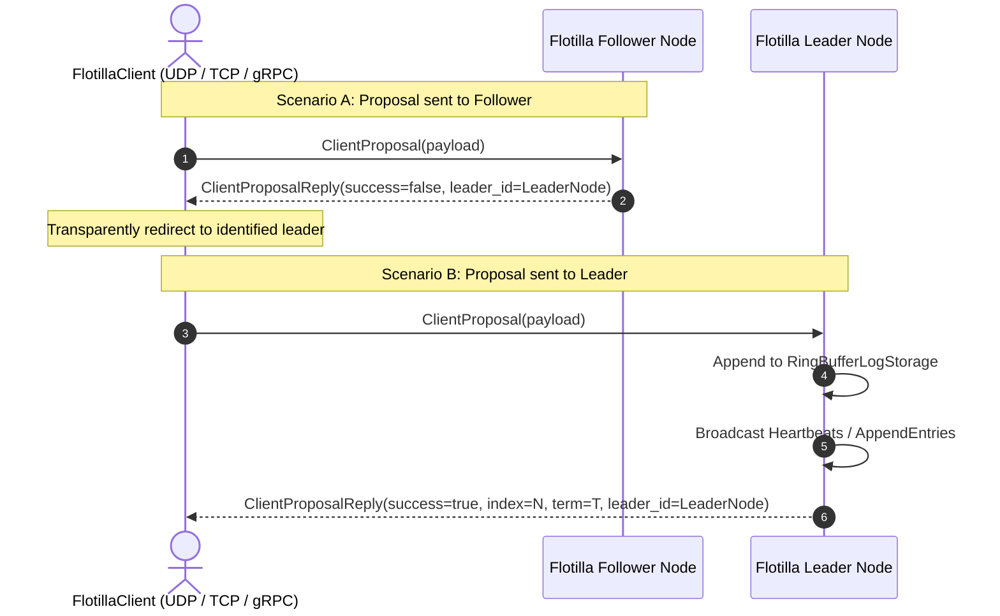

# Raft State Machine Specification (L2)

Flotilla implements the Raft consensus algorithm (Ongaro & Ousterhout) with a deterministic, Sans-I/O execution model in Safe Rust 2024.

---

## 1. Raft Invariants Enforced

1. **Election Safety**: At most one leader can be elected in any given term.
2. **Leader Append-Only**: A leader never overwrites or truncates its log entries; it only appends new entries.
3. **Log Matching**: If two logs contain an entry with the same index and term, then the logs are identical in all entries up through the given index.
4. **Leader Completeness**: If a log entry is committed in a given term, then that entry will be present in the logs of the leaders for all higher-numbered terms.
5. **State Machine Safety**: If a server has applied a log entry at a given index to its state machine, no other server will ever apply a different log entry for the same index.

---

## 2. Sans-I/O State Machine Loop

The consensus engine ([`RaftNode`](file:///home/chad/source/rust/flotilla/src/engine/raft_node.rs)) possesses no sockets, timers, or threads. It transitions solely via deterministic memory methods:

- **Logical Time**: Advanced via `node.tick() -> Vec<OutboundMessage>`.
- **Inbound Protocol Traffic**: Evaluated via `node.step(sender: NodeId, packet_bytes: &[u8]) -> Result<Vec<OutboundMessage>, EngineError>`.
- **Client Proposals**: Submitted via `node.propose(payload: &[u8]) -> Result<LogIndex, EngineError>`.
- **Storage Compaction**: Watermark advanced via `node.compact_watermark(watermark: LogIndex) -> Result<(), StorageError>`.

### Outbound Actions

State transitions produce [`OutboundMessage`](file:///home/chad/source/rust/flotilla/src/engine/outbound_message.rs) enums:
1. `OutboundMessage::SendPacket { to: NodeId, packet: Vec<u8> }`: Protocol envelope to be dispatched across the active transport (UDP, TCP, or gRPC).
2. `OutboundMessage::ApplyEntries { from_index: LogIndex, to_index: LogIndex }`: Committed log index slice ready for application to the state machine or ingestion by the archival pipeline.

---

## 3. Election Mechanics

Defined across [`src/election/`](file:///home/chad/source/rust/flotilla/src/election/):

- **Timer Advancement**: Each `node.tick()` increments the `election_elapsed` counter.
- **Election Timeout**: When `election_elapsed >= randomized_election_timeout`, a Follower becomes a Candidate:
  1. Increments `current_term`.
  2. Votes for itself.
  3. Resets `election_elapsed`.
  4. Dispatches `RequestVoteArgs` envelopes to all peers.
- **Vote Evaluation** ([`src/election/rules.rs`](file:///home/chad/source/rust/flotilla/src/election/rules.rs)):
  - A voter grants its vote only if:
    - `args.term >= current_term`.
    - Voter hasn't voted for another candidate in this term (`voted_for == NodeId::NONE` or `args.candidate_id`).
    - Candidate log is at least as up-to-date as receiver log (`args.last_log_term > last_term`, or `args.last_log_term == last_term && args.last_log_index >= last_index`).
- **Leader Transition**:
  - Upon collecting votes from a strict quorum (`votes > cluster_size / 2`), the Candidate transitions to `Role::Leader`.
  - Resets all peer `next_index` trackers to `last_log_index + 1`.
  - Immediately broadcasts empty `AppendEntriesArgs` (heartbeats) to establish authority.

---

## 4. Replication & Commit Advancement

Defined across [`src/replication/`](file:///home/chad/source/rust/flotilla/src/replication/) and [`src/commit.rs`](file:///home/chad/source/rust/flotilla/src/commit.rs):

- **Leader Append**: The leader appends entry to its local [`RingBufferLogStorage`](file:///home/chad/source/rust/flotilla/src/storage/ring_buffer_log_storage.rs) and replicates to followers via `AppendEntriesArgs`.
- **Follower Log Append Evaluation** ([`src/replication/evaluator.rs`](file:///home/chad/source/rust/flotilla/src/replication/evaluator.rs)):
  - Verifies `hdr.term >= current_term`.
  - Verifies log contains entry at `prev_log_index` with matching `prev_log_term`.
  - If match fails, returns `FollowerAppendResult::Rejected`, causing leader to decrement `next_index`.
  - If match succeeds, appends new entries (overwriting any conflicting uncommitted entries) and returns `FollowerAppendResult::Success { match_index }`.
- **Quorum Commit Advancement** ([`src/commit.rs`](file:///home/chad/source/rust/flotilla/src/commit.rs)):
  - Follower replies update `match_index[peer]` in [`PeerProgressTracker`](file:///home/chad/source/rust/flotilla/src/replication/peer_progress_tracker.rs).
  - Leader computes the quorum median of `match_index` across all nodes.
  - If median $N > \text{commit\_index}$ and `log[N].term == current_term` (Raft §5.4.2), `commit_index` advances to $N$.
  - The node emits `OutboundMessage::ApplyEntries { from_index: old_commit + 1, to_index: N }`.

---

## 5. Client Proposal Lifecycle & Leader Redirection

Client proposals enter via direct method call (`node.propose`) or wire datagrams (`MsgType::ClientProposal`):

1. **Proposal to Leader**:
   - Leader appends payload into static ring buffer at `current_term`.
   - Broadcasts replication datagrams to peer progress targets.
   - Emits [`ClientProposalReply`](file:///home/chad/source/rust/flotilla/src/message/client_proposal_reply.rs) with `success = 1`, `index = new_index`, `term = current_term`, and `leader_id = self.id`.
2. **Proposal to Follower or Candidate**:
   - Node immediately rejects the proposal (`success = 0`).
   - Node includes `leader_id = voted_for` (or `0` if unknown) in the reply.
   - Client drivers (`UdpClient`, `TcpClient`, `GrpcClient`) inspect `leader_id` and can redirect subsequent proposals to the active leader.
